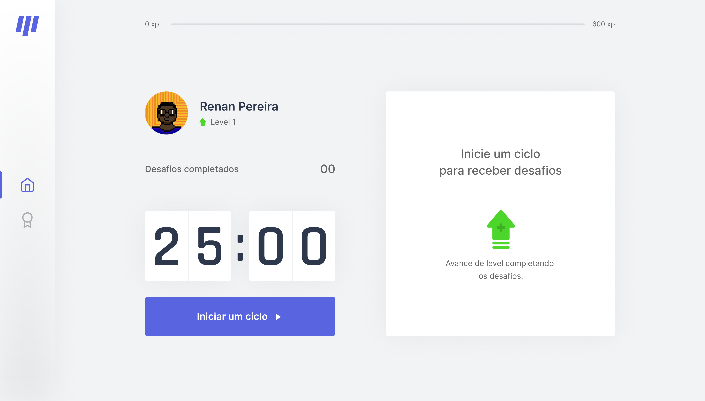

<p align="center">

</p>

# Move it
> A app to make you move! Written in Next.js

---

<div align="left">


[](https://github.com/styled-components/styled-components)


</div>

---

# 🛠 Technologies used

- Next.js
- Typescript
- Jest
- Testing Library
- styled-components
- next-auth
- Storybook
- nookies
- react-icons
- husky

# 🎉 Contributing

[Check this step by step](CONTRIBUTING.md)

# 🤔 How to run

Clone repository:
```bash
$ git clone https://github.com/r3nanp/move.it.git
```

At the root of the project, run:
```bash
yarn or npm install
```

Copy the `.env.example` file to `.env` and fill the values:
```bash
cp .env.example .env.local
```

Run the following command in order to start the application in a development environment:
```bash
yarn dev or npm run dev
```

# 🎨 Layout




## [Layout](https://www.figma.com/file/KNXg7ZZO8VY59RZwZqC0n5/Move.it-2.0-(Copy)?node-id=149721%3A851)

<br />

# License 📚

[MIT license](LICENSE).

Made by [Renan Pereira](https://github.com/r3nanp)

Give a ⭐️!
